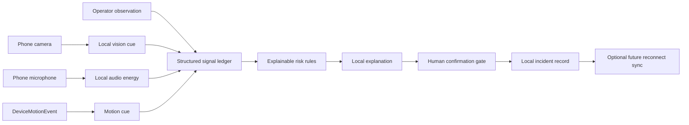

# Quiet Command — Judge Pack

## One-line pitch

**Quiet Command is a phone-first, offline emergency copilot that turns real camera, microphone, and motion signals into an inspectable risk recommendation—without pretending uncertain evidence is certain, and without allowing a machine recommendation to become a final action without a human.**

## What is actually implemented

| Capability | Implementation truth | Why it matters |
|---|---|---|
| Phone camera | Browser camera permission plus a browser-local TensorFlow.js COCO-SSD person detector. | Demonstrates real on-device computer vision and makes the evidence source visible. TensorFlow.js supports running models directly in the browser [1]. |
| Phone microphone | Browser microphone permission plus local RMS audio-energy measurement. | Uses a real microphone reading without falsely claiming a trained alarm classifier. |
| Phone motion | `DeviceMotionEvent` with explicit permission flow and acceleration-spike detection. | Uses a real phone sensor and handles mobile-browser permission requirements honestly [2]. |
| Situation fusion | Local structured JSON combines sensor signals and operator cues. | Keeps every stage inspectable instead of hiding the logic inside a black box. |
| Risk engine | Explainable weighted rules with visible reasons, score, freshness, and confidence. | Safety-related recommendations can be challenged and audited. |
| Explanation layer | Local natural-language explanation generated from the structured assessment. | No cloud AI request is required for the core decision path. |
| Human gate | High-risk recommendations require a deliberate press-and-hold before they are logged as final. | Prevents accidental machine finalization. |
| Offline behavior | PWA manifest, service worker cache, localStorage summary staging, and a visible offline mode. | PWA caching is designed to keep an app shell usable without network connectivity [3]. |
| Rehearsal mode | Clearly labeled simulated cues for stage reliability. | Allows a repeatable demo without presenting fake detections as live model output. |

## The judge demonstration

Begin in the calm state. Say: “The app starts with no hazard confirmed. It does not invent a result, and no final action is available.” Enable motion, microphone, and camera one at a time. Explain that the permission flow is deliberate because browsers protect motion, camera, and microphone access; motion permissions may require a direct user gesture [2], while camera and microphone access require HTTPS and explicit permission [4].

Next, show the camera feed and point to the model badge. Say: “The vision model is local to the browser. It reports what it sees as a presence cue; it does not claim smoke detection unless a tested smoke model is installed.” This sentence is important because it demonstrates product honesty rather than hiding model limits.

For the reliable stage moment, turn on **Rehearsal mode**. The app will visibly label all rehearsal signals as `REHEARSAL` and `Operator rehearsal`. Mark the exit as blocked. The risk state should become HIGH, the recommendation should name the alternate exit, the explanation card should list the exact reasons, and the structured trace should expose JSON provenance. Say: “This is not a hidden fake. We are deliberately rehearsing the incident, and the UI says so. The same fusion path is used for live readings.”

Finally, point to the dark human-gate card. Say: “The recommendation is still not final. A person must hold to confirm it. This is the design decision we would keep in a safety-critical deployment.” Hold the button for the required duration and show the local confirmation timestamp. Then turn off connectivity and reload the app to demonstrate that the shell and local decision path remain available after the network drops. The model pack should be warmed once while online before the disconnected demo; the service worker caches requested resources, and TensorFlow.js can also save models to browser storage such as IndexedDB in a production-hardening pass [5].

## Why this fits the target audience

The first target audience is campus safety teams, event operators, and student volunteers who may have a phone but no reliable network, no dedicated command-center hardware, and limited time to interpret conflicting signals. The product is intentionally narrow: one phone, one building-fire scenario, and a traceable decision path. This is more credible than claiming to solve fire, flood, earthquake, mesh networking, and digital twins in one prototype.

The second audience is safety-system designers and judges evaluating responsible AI. Their key question is not simply “does it use AI?” It is “what happens when the model is wrong, the device is offline, or the evidence is incomplete?” Quiet Command answers those questions directly through provenance labels, visible unavailable states, explainable rules, and human confirmation.

## Implementation architecture

The architecture is intentionally layered. Signals become structured records first. The rules engine consumes those records, not raw media. The explanation layer consumes the rules output, not hidden sensor state. The human gate is the only path that marks a recommendation as final.

## Scalability plan

| Stage | Upgrade | Reason |
|---|---|---|
| Hackathon build | One PWA, one phone, browser-local model, local rules, local record. | Fastest way to prove the safety concept with no backend dependency. |
| Pilot deployment | Move incident records from localStorage to IndexedDB, add model-pack versioning, add a tested smoke/audio adapter, and add a device capability matrix. | IndexedDB is appropriate for structured offline data, while Cache Storage is intended for URL-addressable resources [6]. |
| Campus rollout | Add signed model manifests, device enrollment, role-based confirmation, replayable incident logs, and a local-network command-center bridge. | Enables fleet governance without changing the core signal contract. |
| Production | Use an edge gateway for optional sync, versioned model artifacts, observability, privacy retention rules, and fail-safe escalation policies. | Keeps the offline path primary while enabling institutional operations. |

The scaling principle is **scale the signal contract, not the demo UI**. Every new sensor should implement the same fields: status, value, confidence, source, timestamp, and detail. A thermal sensor, Bluetooth beacon, or gas sensor can join later without changing the risk engine’s shape. Model updates should be versioned and signed; a failed or unavailable model must degrade to “unavailable,” never to a fabricated live result.

## What we deliberately do not claim yet

We do not claim certified fire detection, medical fall diagnosis, gas detection, thermal imaging, alarm classification, multi-device mesh networking, automatic emergency-service dispatch, or a production-grade local LLM running inside the phone browser. Those are roadmap items. The current product is a responsible decision-support prototype with a real browser-local model for person detection, real microphone energy, real device motion, transparent operator cues, and a local explainable risk path.

## Strong answers to likely judge questions

**“Is this really AI?”** Yes, the camera path uses a pretrained TensorFlow.js model locally in the browser. The risk layer is intentionally transparent rules, not a black box. In a safety system, model inference and explainable policy are different layers.

**“What happens if the model is wrong?”** The evidence is labeled with confidence and provenance, the UI exposes unavailable states, the recommendation is never final automatically, and a human must confirm it.

**“What happens without internet?”** The PWA shell is cached locally and the risk engine does not call a cloud API. The browser model pack should be warmed once while online; a production version would explicitly prefetch and persist the model using IndexedDB, which TensorFlow.js supports [5].

**“Why not add more sensors?”** Because a safety prototype is more credible when one real pipeline works end to end. The signal contract makes future sensors additive without weakening traceability.

**“Who pays for this?”** Institutions with duty-of-care responsibilities—campuses, event venues, hostels, factories, and emergency-response training programs—could pay for deployment governance, model management, audit logs, and optional command-center sync. The first value is not a consumer subscription; it is reducing ambiguity in the first minute of an incident.

## References

[1]: https://www.tensorflow.org/js "TensorFlow.js: machine learning directly in the browser"
[2]: https://developer.mozilla.org/en-US/docs/Web/API/DeviceMotionEvent/requestPermission_static "MDN: DeviceMotionEvent.requestPermission()"
[3]: https://developer.mozilla.org/en-US/docs/Web/Progressive_web_apps/Guides/Caching "MDN: Progressive web app caching"
[4]: https://developer.mozilla.org/en-US/docs/Web/API/MediaDevices/getUserMedia "MDN: MediaDevices.getUserMedia()"
[5]: https://www.tensorflow.org/js/guide/save_load "TensorFlow.js: Save and load models"
[6]: https://web.dev/learn/pwa/offline-data "web.dev: Offline data for PWAs"
